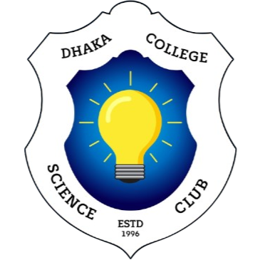

<div align="center">



# 🔬 Dhaka College Science Club (DCSC)

### *Spreading the knowledge of science to the utmost since 1996*

[](https://dcsc.vercel.app)
[](https://www.facebook.com/DhakaCollegeScienceClub)
[](https://www.instagram.com/dcsc_official)

**#ForClubAndCountry**

</div>

---

## 📖 About

**Dhaka College Science Club (DCSC)** is one of the most prestigious science clubs in Bangladesh, established in **1996**. Our mission is to ignite scientific curiosity, foster innovation, and build a community of passionate science enthusiasts among the students of Dhaka College.

This repository contains the **official website** of DCSC — a modern, responsive, and visually stunning static website built with vanilla HTML, CSS, and JavaScript.

---

## ✨ Features

| Feature | Description |
|---|---|
| 🌙☀️ **Dark / Light Mode** | Full theme toggle with separate optimized designs for each mode |
| 📱 **Fully Responsive** | Works flawlessly on mobile, tablet, and desktop |
| 🏠 **Home Page** | Hero section, posts, 2025 recap slider, Intra Fest gallery, achievements preview |
| 📅 **Events** | Detailed event pages — Neuroverse, Freshers', Quizzing, and more |
| 🏆 **Achievements** | Showcase of club achievements and accolades |
| 👥 **Committee** | Executive committee members, moderators, and advisors |
| 🖼️ **Gallery** | Photo gallery from events and festivals |
| 📝 **Posts** | Club news, updates, and announcements |
| 🔬 **Sci-Lab** | Interactive science games — Chemistry reactions, Gravity simulator, Atom builder, Quiz |
| 🪪 **Join & ID Card** | Member registration form with live ID card preview & download (PNG/PDF) |
| 📜 **Certificate Generator** | Generate participation/achievement certificates with download (PNG/PDF) |
| 🗺️ **Google Maps** | Embedded location of DCSC |
| 🎵 **Background Music** | Optional ambient music toggle |
| 🧪 **Particle Animation** | Interactive canvas background in dark mode |

---

## 🛠️ Tech Stack

| Technology | Usage |
|---|---|
| **HTML5** | Page structure and semantic markup |
| **CSS3** | Custom styling, animations, glassmorphism, responsive design |
| **JavaScript** | Theme toggle, sliders, interactive games, form handling |
| **Google Fonts** | Orbitron, Space Grotesk, Plus Jakarta Sans, Hind Siliguri |
| **Font Awesome 6** | Icons throughout the site |
| **html2canvas** | ID card & certificate screenshot/download |
| **jsPDF** | PDF generation for ID cards & certificates |

---

## 📁 Project Structure

```
DCSC/
├── index.html              # 🏠 Home page
├── about.html              # ℹ️ About DCSC
├── events.html             # 📅 Events listing
│   ├── event-freshers.html # Freshers' Orientation
│   ├── event-neuroverse.html # Neuroverse event
│   ├── event-quizzing.html # Quizzing event
│   └── event-us.html       # US event
├── achievements.html       # 🏆 Achievements
├── committee.html          # 👥 Executive Committee
├── gallery.html            # 🖼️ Photo Gallery
├── posts.html              # 📝 News & Updates
├── join.html               # 🪪 Join + ID Card + Certificate
├── wall-magazine.html      # 📰 Wall Magazine
├── scilab.html             # 🔬 Sci-Lab Hub
│   ├── scilab-chem.html    # Chemistry Lab
│   ├── scilab-atom.html    # Atom Builder
│   ├── scilab-gravity.html # Gravity Simulator
│   ├── scilab-quiz.html    # Science Quiz
│   └── scilab-sandbox.html # Sandbox
├── cert-verify.html        # ✅ Certificate Verification
├── certificates.html       # 📜 Certificate Database
├── style.css               # 🎨 Main stylesheet
├── app.js                  # ⚙️ Main JavaScript
├── image/                  # 🖼️ Image assets
├── music/                  # 🎵 Audio files
└── assets/                 # 📦 Additional assets
```

---

## 🚀 Getting Started

### Prerequisites
- Any modern web browser (Chrome, Firefox, Edge, Safari)
- No build tools or dependencies required!

### Run Locally

1. **Clone the repository**
   ```bash
   git clone https://github.com/your-username/DCSC.git
   ```

2. **Open in browser**
   ```bash
   cd DCSC
   ```
   Simply open `index.html` in your browser, or use a local server:
   ```bash
   # Using Python
   python -m http.server 8000

   # Using Node.js
   npx serve .
   ```

3. **Visit** `http://localhost:8000`

---

## 🎨 Design Highlights

- **Typography**: Orbitron for headings/brand, Space Grotesk for titles, Plus Jakarta Sans for body text
- **Color Palette**:
  - 🌙 Dark Mode: Obsidian dark `#080C14` with cyan neon `#00F2FE` and gold `#FFD700` accents
  - ☀️ Light Mode: Clean white `#F1F5F9` with sky blue `#0284C7` and amber `#B45309` accents
- **Effects**: Glassmorphism, backdrop blur, gradient borders, micro-animations, scroll-triggered reveals
- **Responsive**: Mobile-first approach with optimized layouts for all screen sizes

---

## 📸 Screenshots

<div align="center">

| Dark Mode | Light Mode |
|---|---|
|  |  |

</div>

> 💡 *Replace the screenshot paths with actual screenshots of your website*

---

## 🤝 Contributing

We welcome contributions from DCSC members and the community!

1. Fork the repository
2. Create your feature branch (`git checkout -b feature/amazing-feature`)
3. Commit your changes (`git commit -m 'Add amazing feature'`)
4. Push to the branch (`git push origin feature/amazing-feature`)
5. Open a Pull Request

---

## 📄 License

This project is maintained by **Dhaka College Science Club (DCSC)**. All rights reserved.

---

## 👨‍💻 Credits

<div align="center">

**Website designed & developed by**

### [Abdullah Al Adib](https://adi.pro.bd/)

</div>

---

<div align="center">

**Dhaka College Science Club (DCSC)**
*Est. 1996 • Dhaka, Bangladesh*

*Spreading the knowledge of science to the utmost*

**#ForClubAndCountry** 🇧🇩

</div>
